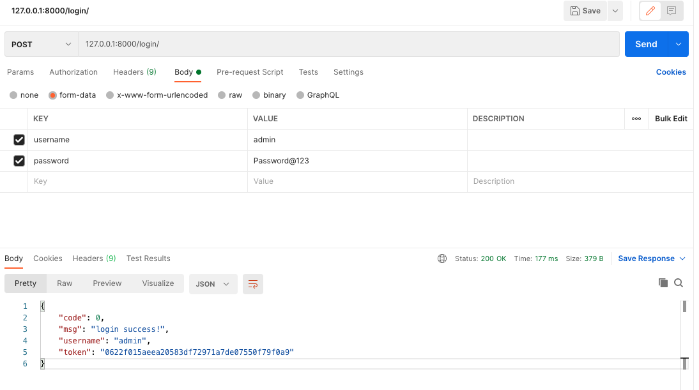
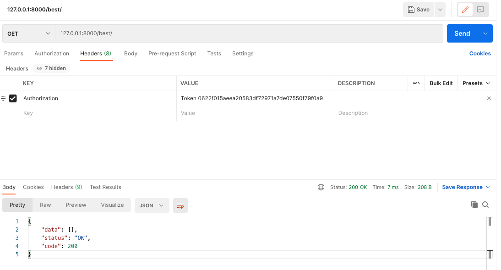
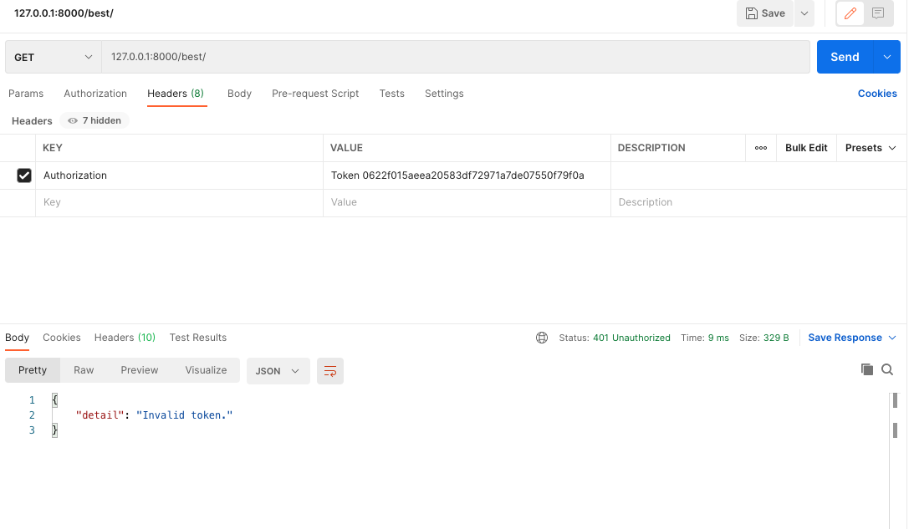
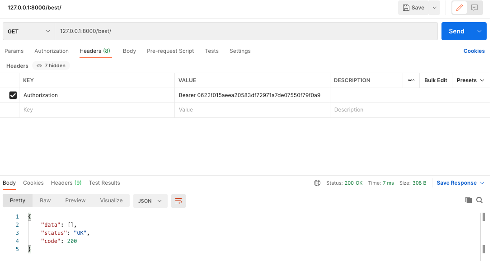

#### `Rest Framework` 的 `Token` 权限认证

搭建好[一个简单的 `django` 应用后](./Start.md)，我们开始进行身份认证。身份验证是将传入请求与一组标识凭据（例如请求来自的用户或其签名的令牌）相关联的机制。然后，权限 和 限制 可以使用这些凭据来确定是否应允许该请求。

REST framework 提供了一些开箱即用的身份验证方案，并且还允许你实现自定义方案。

验证始终在视图的最开始进行，在执行权限和限制检查之前以及允许任何其他代码继续执行之前。

`request.user` 属性通常被设置为`contrib.auth` 包中 `User` 类的一个实例。

`request.user` 属性通常被设置为`contrib.auth` 包中 `User` 类的一个实例。

> **注意：** 不要忘了**认证本身不会允许或拒绝传入的请求**，它只是简单识别请求携带的凭证。


###### 如何确定身份验证

认证方案总是被定义为一个类的列表。`REST framework` 将尝试使用列表中的每个类进行身份验证，并使用成功完成验证的第一个类的返回值设置 `request.user` 和`request.auth`。

如果没有类进行验证，`request.user` 将被设置成 `django.contrib.auth.models.AnonymousUser`的实例，`request.auth` 将被设置成`None`。

未认证请求的`request.user` 和 `request.auth` 的值可以使用 `UNAUTHENTICATED_USER`和`UNAUTHENTICATED_TOKEN` 设置进行修改。


###### `API` 参考

一般来说，`API` 会使用简单的基于 `Token` 的 `HTTP` 认证方案，`Token` 认证适用于客户端 - 服务器设置。要使用`TokenAuthentication`方案，你需要 `配置认证类` 以便包含`TokenAuthentication`，另外在`INSTALLED_APPS`设置中还需要包含`rest_framework.authtoken`：

```shell
INSTALLED_APPS = (
    ...
    'rest_framework.authtoken'
)

MIDDLEWARE = [
    'django.middleware.security.SecurityMiddleware',
    'django.contrib.sessions.middleware.SessionMiddleware',
    'django.middleware.common.CommonMiddleware',
    'django.middleware.csrf.CsrfViewMiddleware',
    'django.contrib.auth.middleware.AuthenticationMiddleware',
    'django.contrib.messages.middleware.MessageMiddleware',
    'django.middleware.clickjacking.XFrameOptionsMiddleware',
]

ROOT_URLCONF = 'tutorial.urls'

REST_FRAMEWORK = {
    'DEFAULT_AUTHENTICATION_CLASSES': (
        'rest_framework.authentication.TokenAuthentication',
    ),
    'DEFAULT_PERMISSION_CLASSES': [
        'rest_framework.permissions.IsAuthenticated',
    ],
}
```

> **注意：** 确保在修改设置后运行一下`manage.py migrate`。`rest_framework.authtoken` app 会提交一些Django数据库迁移操作。


- 生成 `Token`

在 `best` 目录下创建文件 `token.py`

```python
from rest_framework.decorators import api_view, permission_classes
from rest_framework.permissions import IsAuthenticated, AllowAny
from django.http import JsonResponse
from rest_framework.authtoken.models import Token
from django.contrib.auth import authenticate
from django.utils import timezone


@api_view(['GET'])
@permission_classes((IsAuthenticated,))
def best(request):
    response = {
        'data': [],
        'status': 'OK',
        'code': 200
    }
    print(request.user, request.auth)
    return JsonResponse(response)


@api_view(['POST'])
@permission_classes((AllowAny,))
def login(request):
    username = request.data.get('username')
    password = request.data.get('password')
    user = authenticate(username=username, password=password)
    token, created = Token.objects.get_or_create(user=user)
    if not created:
        token.created = timezone.now()
        token.save()
    return JsonResponse({
        "code": 0,
        "msg": "login success!",
        "username": user.username,
        "token": token.key,
    })
```

修改 `tutorial` 目录下 `urls.py` 文件

```python
...
from kind import token

urlpatterns = [
	...
	path('best/', token.best),
	path('login/', token.login),
]
```

现在我们创建一个超级用户来做测试

```shell
(env)[~/tutorial] python manage.py createsuperuser
Username (leave blank to use 'admin'): admin
Email address: admin@admin.com
Password:
Password (again):
Superuser created successfully.
```


###### 开始测试

通过登录接口获取 `token`



通过 `token` 成功获取信息



通过错误的 `token` 来测试



> 注意：此时这个地方的 `Header` 里面的值前面需要使用 `Token` 而不是 `Bearer`
>
> 如果想使用 `Bearer`，只需要继承 `TokenAuthentication` 类并设置 `keyword` 类变量。


###### 现在将 `Header` 中的 `Token` 改为 `Bearer`

创建文件 `best/cus_token.py`

```python
from rest_framework.authentication import TokenAuthentication

class CustomAuthToken(TokenAuthentication):
  keyword = 'Bearer'
```

修改文件 `tutorial/setting.py`

```python
REST_FRAMEWORK = {
    'DEFAULT_AUTHENTICATION_CLASSES': (
        # 'rest_framework.authentication.TokenAuthentication',
        'best.cus_token.CustomAuthToken',
    ),
    'DEFAULT_PERMISSION_CLASSES': [
        'rest_framework.permissions.IsAuthenticated',
    ],
}
```

来看看测试结果




###### 如何自定义 `token` 处理方式

在 `best/cus_token.py` 文件中修改类 `CustomAuthToken` ，在类中修改 继承自父类 `TokenAuthentication` 的 `authenticate` 和 `authenticate_credentials` 方法即可。

