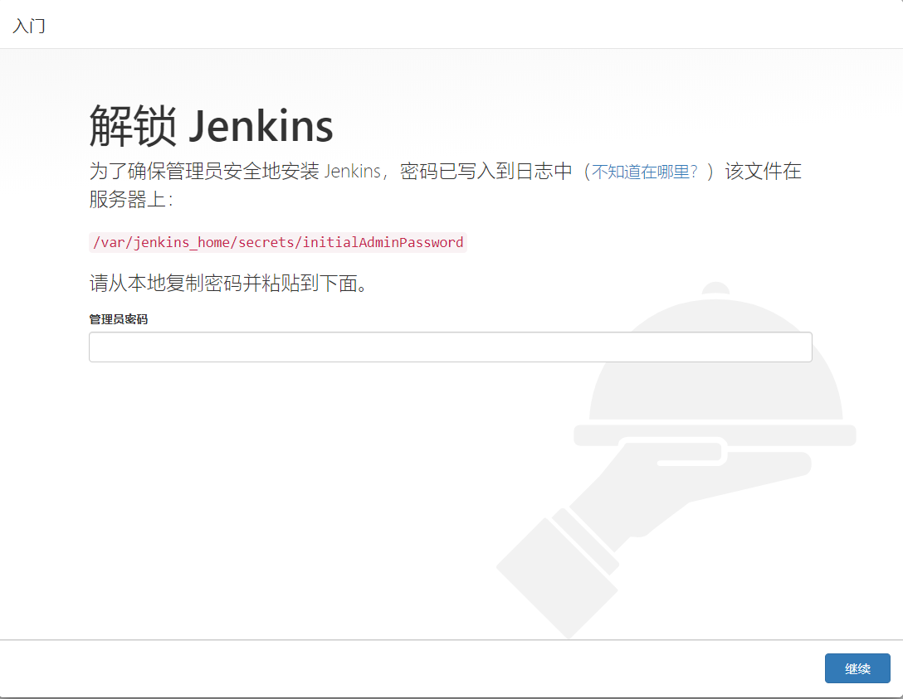

# `Jenkins` 安装

> `Jenkins` 是一个持续集成的工具，帮你构建和打包自动化，不用手动做这些操作。构建完成后可以帮你上传到第三方测试平台，或者做其他一些操作。例如：发送邮件通知测试人员可以开始测试了，邮件中包含下载地址，或者二维码。整个流程不需要手动管理，非常高效。


## `Docker` 中的 `Jenkins`

`Jenkins` 官方提供了 `docker` 的[镜像](https://hub.docker.com/_/jenkins)，可以直接使用

#### 拉取镜像

```shell
[root@root ~]$ docker pull jenkins/jenkins:lts
```

#### 启动服务

```shell
[root@root ~]$ docker run -d --name jenkins -p 8081:8080 -v /var/jenkins_home:/var/jenkins_home -v /etc/localtime:/etc/localtime -v /etc/timezone:/etc/timezone jenkins/jenkins:lts
```

> tips:
>
> -d //启动在后台
> --name //容器名字
> -p //端口映射（8081:宿主主机端口，8080:容器内部端口）
> -v //数据卷挂载映射（前一个 /var/jenkins_home:宿主主机目录(注意权限)，/var/jenkins_home另外一个即是容器目录）
> jenkins/jenkins:lts 镜像名称 此处使用 jenkins/jenkins:lts 镜像的 id 也可以(通过 docker images 获取镜像 id) //Jenkins镜像（最新版）

#### 查看是否启动成功

```shell
[root@root ~]$ docker ps -l
CONTAINER ID	IMAGE					COMMAND									CREATED			STATUS		PORTS													NAMES
82827552c1a3	1920bf702d7d	"/sbin/tini -- /usr/…"	2 days ago	Up 2 days 50000/tcp,0.0.0.0:8081->8080/tcp   jenkins
```


#### 查看 `docker` 容器日志

```shell
[root@root ~]$ docker logs jenkins
```


#### 访问 `Jenkins`

打开浏览器访问 http://localhost:8081 即可，如下图




#### 密码根据网页上的说明即可获取

```shell
[root@root ~]$ cat /var/jenkins_home/secrets/initialAdminPassword
```


输入密码后按照网页说明走完即可正常使用 `Jenkins` 了

