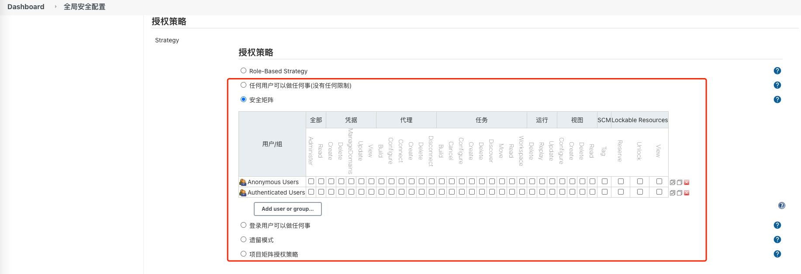
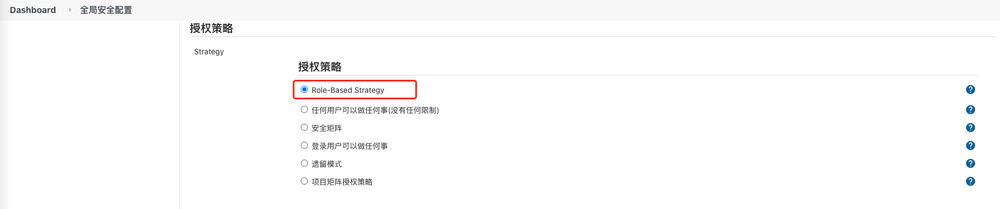
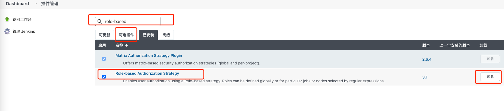
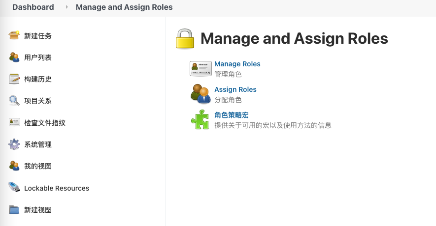
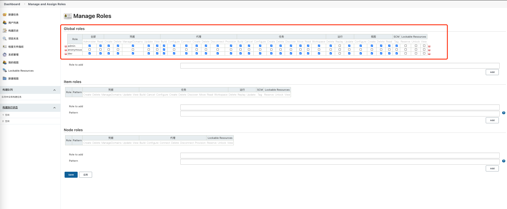
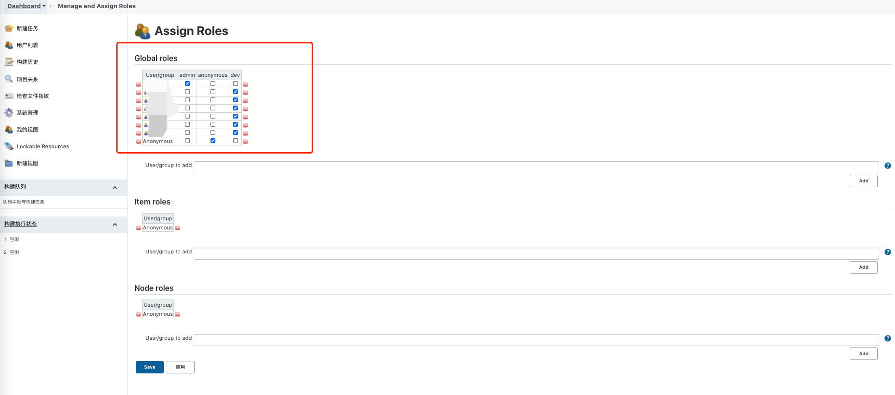

# `Jenkins` 权限管理

本章介绍一下 `Jenkins` 的权限管理，`Jenkins` 本身拥有自己的一套授权策略，不过较为简单，推荐使用 [Role-based Authorization Strategy](https://plugins.jenkins.io/role-strategy) 插件，接下来介绍一下两种方式的权限管理方式

## 查看权限设置

打开已安装的 `Jenkins` 网站，找到 `系统管理` => `全局安全配置` => `授权策略`

如果没有安装可参考 [这里](install.md)

### `Jenkins` 自身权限管理

查看授权策略页面可以看到内容如下

> Tips: 未安装 `Role-based Authorization` 插件时不会有 `Role-Based Strategy` 选项

其中 `安全矩阵` 选项和 `项目矩阵授权策略` 选项相差不多，需要对每个用户进行权限授权，较为繁复

其他选项顾名思义即可理解意思(不建议使用 安全矩阵 外的选项)

在该页面勾选好权限后，保存则权限分配完成

### `Role-based Authorization` 插件权限管理

安装 `Role-based Authorization` 插件后，授权策略页面则可以看到  `Role-Based Strategy` 选项

如图选中后即可使用插件进行权限设置，当然还没完

## 接下来介绍 插件的安装和使用

### 安装

找到 `系统管理` => `插件管理`

在可选插件中输入 `role-based` 找到 `Role-based Authroization Strategy` 插件，点击后面的安装

安装好之后需要重启 `Jenkins` 

重启后在插件管理中 已安装 插件中验证是否安装成功

### 使用

#### 找到 `系统管理` => `全局安全配置` => `授权策略`

选择 `Role-Based Strategy` 选项

#### 找到 `系统管理` => `Manage and Assign Roles`

> 插件安装好后系统管理中会出现 `Manage and Assign Roles` 选项

首先 管理角色

其次 分配角色

按需进行 角色和权限的分配即可

> 通过这一步可以看到 这种方式的优点，在用户和权限中间增加了角色的概念，虽然增加了概念，但是权限分配起来更加的顺畅舒服，只要给每种角色分配权限即可，后面增加用户只要给用户进行分配角色就完成了权限的控制，这也是当前比较常见的 `RBAC` 权限控制方式