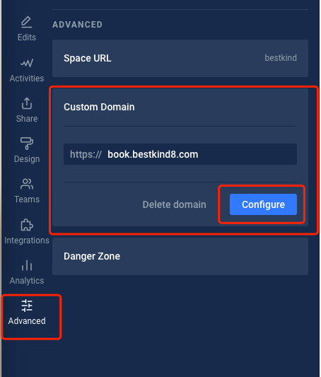
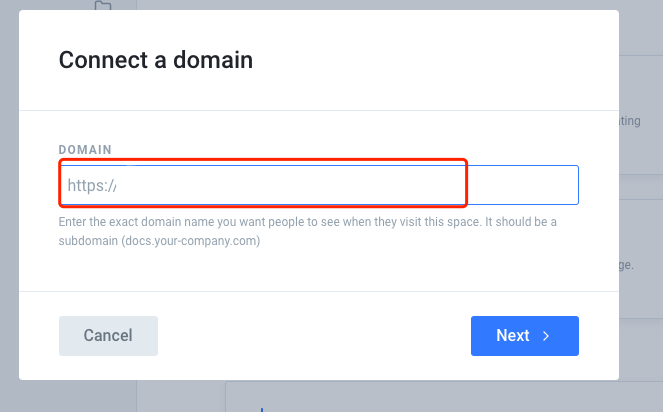
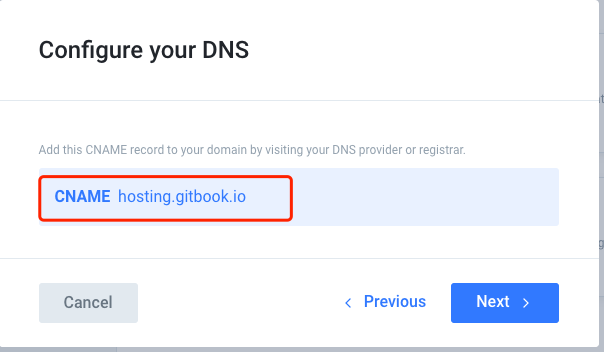
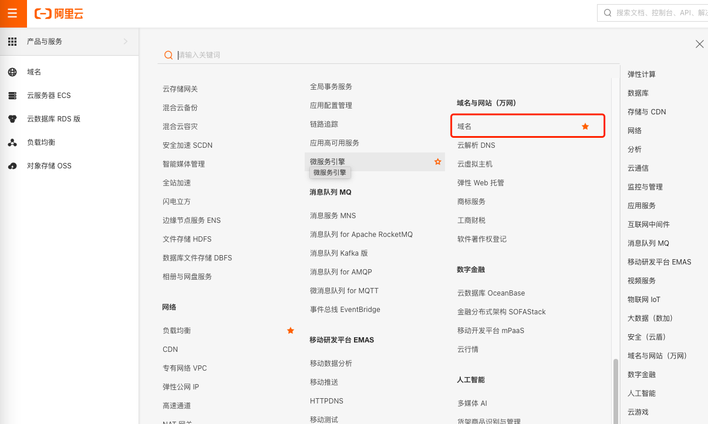
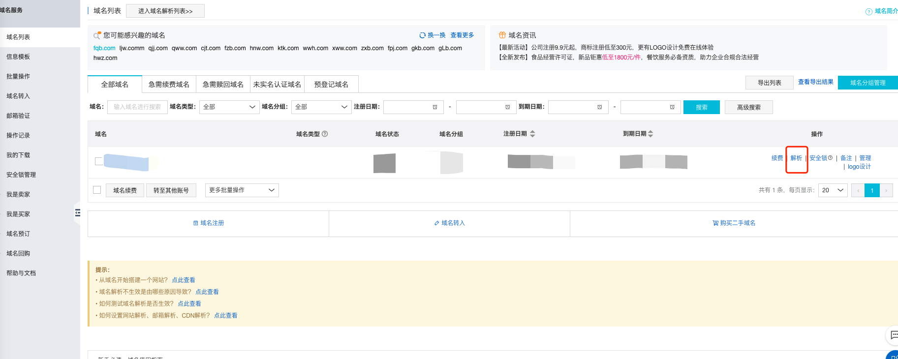
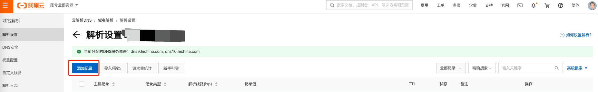
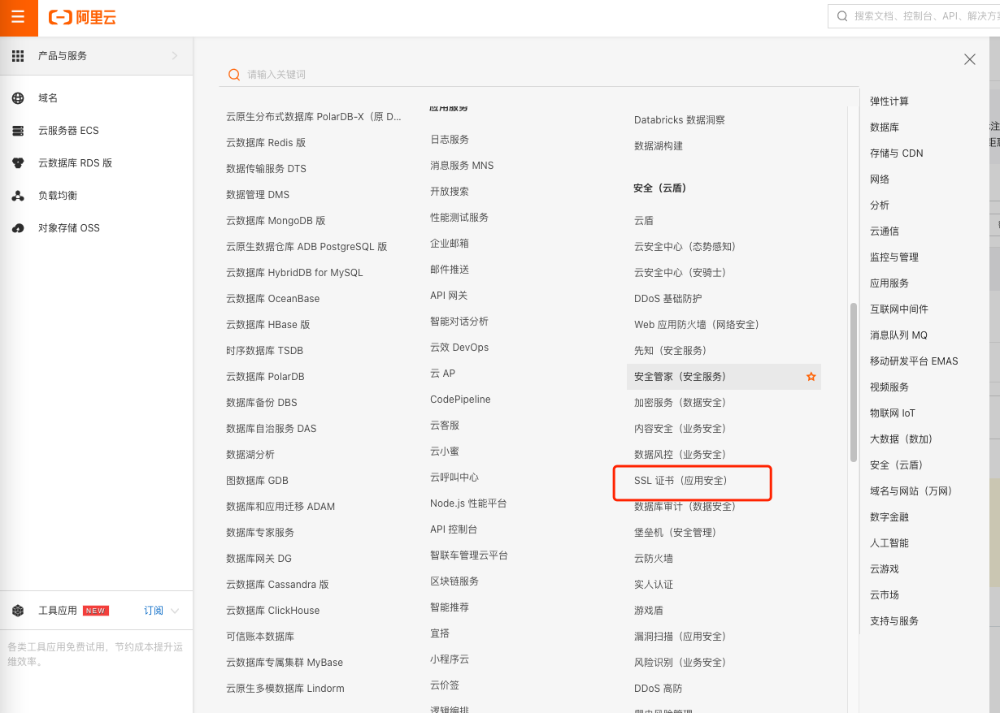
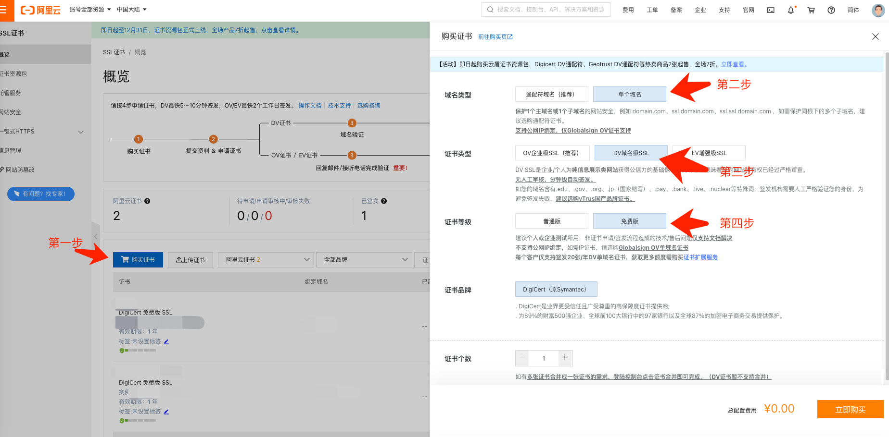
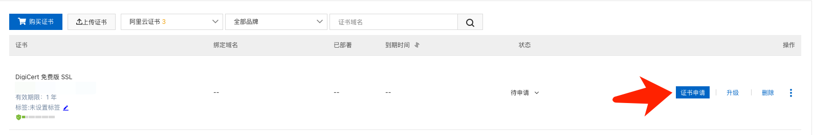

# 配置自定义域名

## 申请自定义域名

申请步骤不做细述，参考阿里云 [万网](https://wanwang.aliyun.com/domain)

假设申请的域名为 `domain.com`

## 确定最终配置的自定义域名

假设最终的自定义域名为 `book.domain.com`

## `GitBook` 配置

### 第一步，点击配置

### 第二步，填入刚刚确定的自定义域名 `book.domain.com`

### 第三步，`DNS` 解析自定义域名

该步骤需要在刚刚购买的域名管理处，解析一个 `CNAME` 域名指向 `hosting.gitbook.io`

### 第四步，域名解析

以阿里云为例：

新开一个页面打开 [阿里云管理后台](https://homenew.console.aliyun.com)

1. 选择域名管理

1. 解析域名

1. 添加解析记录

> 记录类型： 选择 `CNAME`
>
> 主机记录：选择为刚刚最终确定的子域名
>
> 记录值： `hosting.gitbook.io`

### `SSL` 证书关联

解析完之后，需要添加 `ssl` 证书才能使用 `https` 访问

同样以阿里云为例

1. 选择 `SSL` 证书

1. 购买证书

后续的证书个数可以多选，但是年数只能是1年，否则不免费

1. 证书申请

   

按要求填写即可

1. 如果同是阿里云，则不需要进行 `https` 解析，阿里云会自动解析好，否则需要手动进行 `https` 解析

   在 **域名解析** \(刚刚第四步\) 中添加对应的 `TXT` 记录，主机记录 和 记录值 会在证书申请完成后显示出来

以上步骤完成后，返回 `GitBook` 配置域名页面，继续下一步完成 域名的配置，完成后，访问 `book.domain.com` 即是你的 `GitBook` 书籍了

