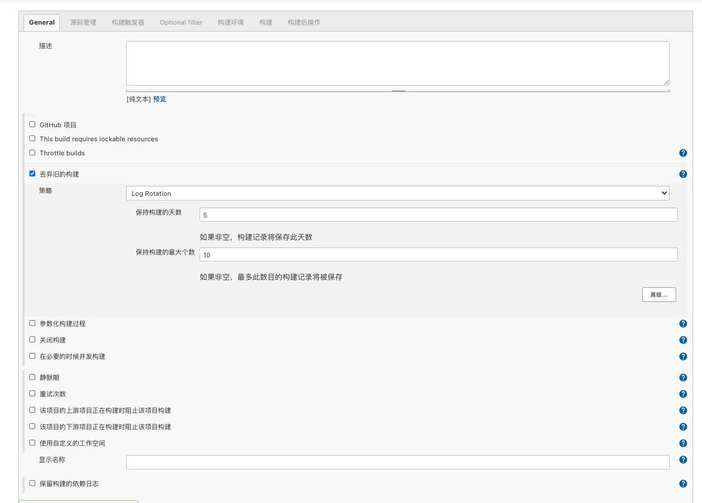

# 构建 Android 项目

一般来说 `Android` 项目打包之后会有一些后续的工作组成一个比较合理的项目 `CI/CD`，本章来介绍一下使用 `Jenkins` 来构建 `Android` 以及后续操作的 `Hook`

## 准备工作

1. `SSH` 凭据

   `系统管理` =&gt; `Manage Credentials` 添加 `SSH` 全局凭据

   

   选择 `SSH` 类型，将机器的用户私钥写入 `Private Key` 中

   > 如果 `Jenkins` 是通过 `docker` 搭建的，则此处的 `private key` 是 `docker` 容器中 `Jenkins` 运行用户的 私钥

2. `Publish over SSH` 插件

   通过这个插件我们可以让 `Jenkins` 通过 `SSH` 的方式跟服务器进行交互，所以需要先把 `SSH` 公钥写入服务器的交互用户的 `.ssh/authorized_keys` 文件中

   安装：`系统管理` =&gt; `插件管理` =&gt; `可选插件` 查询 `Publish Over SSH` 安装然后重启 `Jenkins` 即可

   配置：`系统管理` =&gt; `系统配置` =&gt; `Publish over SSH`

   

   > 一般来说 `SSH` 是不需要单独密码的，所以 `Passphrase` 可以忽略
   >
   > `Path to key`：填写 `Jenkins` 用户 `SSH` 的私钥\(需要注意这里需要生成 `RSA` 格式的 `SSH` 密码\)
   >
   > `Key`：把私钥的内容贴进来
   >
   > `Disable exce`：最好不要勾选
   >
   > `SSH Servers`：
   >
   > ​ `Name`：自定义一个名字
   >
   > ​ `Hostname`：服务器的 `IP`
   >
   > ​ `Username`：服务器与 `Jenkins` 交互的用户名
   >
   > ​ `Remote Directory`：服务器与 `Jenkins` 交互的操作所在目录，后面会用到这个目录，留心哦~
   >
   > 其他选项如果特别需要可以默认即可
   >
   > 配置完成后记得点击右下角的 `Test Configuration` 看看是否配置错误

3. `Android` 项目 `git` 仓库

   将`Jenkins` 用户的 `SSH` 配置到 `git` 仓库中，让 `Jenkins` 可以克隆项目

   在项目的 `git` 仓库中找到 `WebHooks` 中增加一个 `推送事件` 的链接，链接地址：`http://Jenkins访问地址//generic-webhook-trigger/invoke?token=自定义token` 这里的 `自定义 token` 后面会用到哦

4. 下载 `gradle zip` 包、 `walle-cli-all jar` 包、 `android-sdk-linux` 和 `360 加固组件`

   下载好 `gradle` 包、`walle-cli-all` `jar` 包 、 `android-sdk-linux` 和 `360 加固组件` 并放在`Jenkins` 可访问目录

   `360 加固组件` 需要将目录中的 `jiagu.db` 文件替换为已登录后的 `db` 文件

## 创建任务

在工作台选择新建任务，确认项目名称后，选择构建一个自由风格的软件项目


## 配置任务

任务创建完成后，会进入配置页面

### `General` 配置

一般来说，配置页面中的 `General` 看配置项名称大概就能理解什么含义，按需配置即可



### 源码管理


> Repository URL 填入项目 git 地址
>
> Branches to build 表示什么分支会触发 Jenkins 任务

### 构建触发器

勾选 `Generic Webhook Trigger`，在 `Post content parameters` 项目中增加 `ref`，`git_ssh_url`，`username`，`git_message`


> Token：填写准备工作中提到的自定义 token
>
> 其余部分可以按照图片中的方式填写

### 构建环境

该选项中的内容可以不做改动

### 构建

增加构建步骤：`执行shell` 和 `Send files or execute commands over SSH`


1. 执行`shell`

   通过 shell 脚本的使用 grandle 命令方式构建包，并加固，然后打渠道包

   

   提供如下简单命令

   ```text
   #!/bin/bash
   set -x

   # 假设项目名称为 android-test
   BASELOC=`pwd`
   rm -rf $BASELOC/android-test_channel

   # GIT_BRANCH 为 Jenkins 自带可用的环境变量，可以通过上图中的可用环境变量查询可用变量
   BRANCH=`echo '$GIT_BRANCH' | awk -F "/" '{print $NF}'`

   rm -rf /tmp/pkg-android-test-$BRANCH

   git config http.postBuffer 524288000
   git clone git@git服务器/android-test.git /tmp/pkg-android-test-$BRANCH
   cd /tmp/pkg-android-test-$BRANCH
   git checkout $BRANCH

   echo -e "\norg.gradle.daemon=true\norg.gradle.parallel=true" >> ./gradle.properties
   cat ./gradle.properties

   # 默认已经下载好 gradle6.3 zip 包和 walle-cli-all jar 包并放在目录 /var/jenkins_home/android/ 目录下
   cp /var/jenkins_home/android/gradle-6.3-bin.zip ./gradle/wrapper/
   cp /var/jenkins_home/android/walle-cli-all.jar /tmp/pkg-android-test-$BRANCH/walle-cli-all.jar

   sed -i "/distributionUrl/d" ./gradle/wrapper/gradle-wrapper.properties
   echo "distributionUrl=gradle-6.3-bin.zip" >> ./gradle/wrapper/gradle-wrapper.properties
   cat ./gradle/wrapper/gradle-wrapper.properties

   rm -rf local.properties

   if [ -f "local.properties" ]; then
     sed -i "/sdk.dir/d" local.properties
   fi

   # 默认已经下载好 android-sdk-linux 并解压好放在 /var/jenkins_home/android/ 目录下
   echo "sdk.dir=/var/jenkins_home/android/android-sdk-linux" >> local.properties
   chmod -R 777 ./gradlew

   #    区分分支构建不同的包，此处需要注意可能有多个分支，根据实际情况处理，分支在 上述 源码管理 的 Branches to build 处配置
   if [ "$GIT_BRANCH"x = "origin/test"x ]; then
     ./gradlew assembleDebug
     FILEPATH=app/build/outputs/apk/debug/app-debug.apk
   else
     ./gradlew assembleRelease
     FILEPATH=app/build/outputs/apk/release/app-release.apk
   fi

   if [ "$GIT_BRANCH"x = "master"x ]; then
     CHANNEL="UMENG_CHANNEL baidu baidu\n \
                     UMENG_CHANNEL 360 360\n \
              UMENG_CHANNEL tencent tencent\n \
              UMENG_CHANNEL xiaomi xiaomi\n \
              UMENG_CHANNEL huawei huawei\n \
              UMENG_CHANNEL oppo oppo\n \
              UMENG_CHANNEL vivo vivo\n \
     "
     rm -rf /tmp/android-test_channel.txt && echo -e $CHANNEL > /tmp/android-test_channel.txt
     # 加固 各厂商加固命令可能略有不同，此处使用 360 加固，默认已下载 360 加固组件并放在 /var/jenkins_home/android/jiagu 目录下
     java -jar /var/jenkins_home/android/jiagu/jiagu.jar -importsign /tmp/pkg-android-test-$BRANCH/release.jks akl2018 release akl2018
     # 打渠道包
     java -jar /var/jenkins_home/android/jiagu/jiagu.jar -jiagu $FILEPATH $BASELOC/android-test_channel -autosign -automulpkg -pkgparam /tmp/android-test_channel.txt
   fi
   ```

   以上的命令简单的完成了一个 `android` 项目的构建、加固和打渠道包

2. `Send files or execute commands over SSH`

   通过 `Publish over SSH` 方式可以让 `Jenkins` 和服务器进行交互，比如做一些后续的 `CI/CD`，通过其他的方式将打好的包上传的云端 `OSS` 方便后续的下载以及版本发布控制

   

   > `Name`： 选择准备工作中配置的 `Server` 自定义名称
   >
   > `Source files`：想要传递给服务器的文件（该目录以项目在 `Jenkins` 中的工作空间目录为根目录）
   >
   > `Remove prefix`：移除 `source file` 中的目录结构前缀
   >
   > `Remote directory`：远程目录（该目录以 `Publish over SSH` 配置中对应的 `Server` 的 `Remote Directory` 为根目录）
   >
   > `Exec command`：执行 `bash` 命令

### 构建后操作

构建完成后的一些操作


最后这个操作看需求自行选择

> 关于构建后的 `CI/CD` 经验和建议：
>
> 1. 构建完成，通知服务器
> 2. 服务器将构建完成的 apk 按照规则上传到 OSS 并记录 git 版本和对应的包\(可以另外写一个中间件完成\)
> 3. 发布处理通过中间件记录的 git 版本和对应包即可

